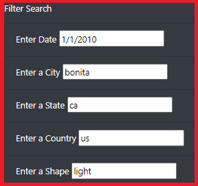
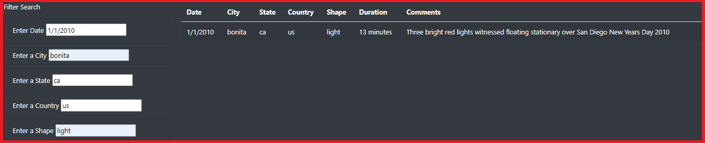
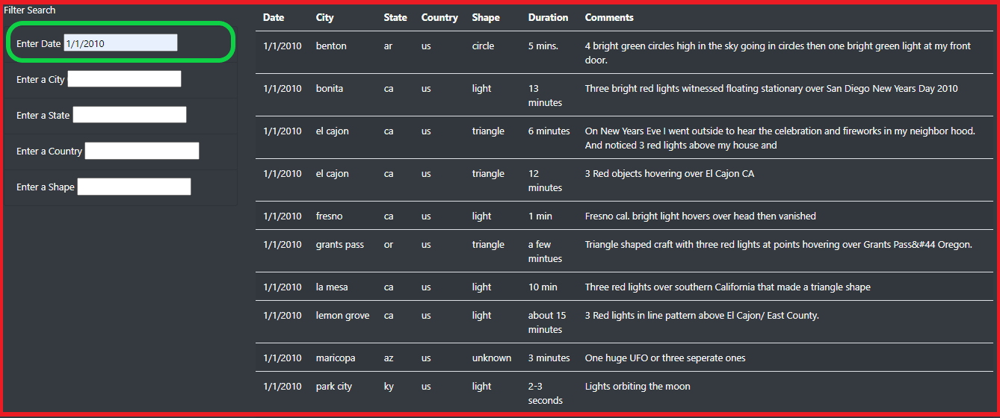
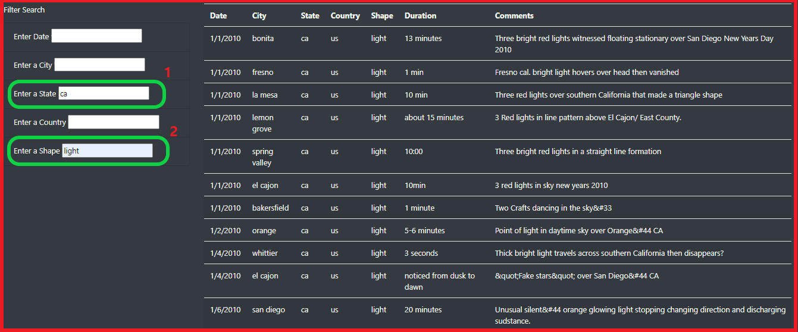
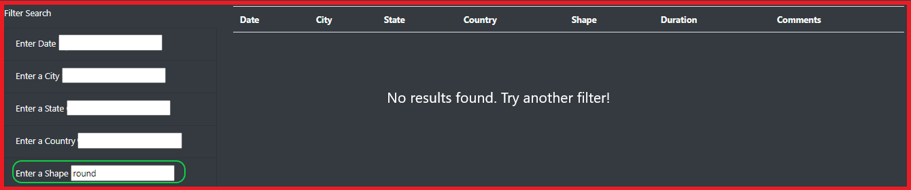

# UFOs

## Project Overview
Dana, a data journalist, has been given an opportunity to write about her hometown MicMinnville, Oregon, which is famous for its UFO sightings. As part of this, Dana decides to put together an html page to find all UFO sighings in the US with the following details:

1. A short description of whether UFO sighings are fact or fiction
2. List of UFO sightings by date, city, state, country, shape and duration
3. Ability to filter the UFO sightings by date, city, state, country, and shape

Using JavaScript and HTML, will be used to modify the code in the index.html file to create more table filters. In addition to the date filter created, additional filters for the city, state, country, and shape will also be created. Using JavaScript, the handleClick() function in your app.js file will be replaced with a new function that saves the element, value, and id of the filter that was changed. Afterwhich, a new function will be created to loop through the dataset and keep only the results that match the search criteria. The webpage will be updated with the search criteria after pressing "Enter".

## Purpose
The purpose of this analysis is to provide a more in-depth analysis of UFO sightings by allowing users to filter for multiple criteria (date, city, state, country, shape) at the same time.

## Resources
- **Data Source:** app.js, index.html, stle.css, ufo_starterCode.js, data.js
- **Software:** Javascript, Bootstrap, CSS, HTML
>
## Results
### How to perform a search, with images
>The user will have 5 options to search and filter the findings by date, city, state, country, and shape.
>
>
>
>If the user chooses all the 5 filters to search for the UFO Sightings, for date, city, state, country, and shape (for example 1/1/2010, bonita, ca, us, light), the table will filter to display the exact match that meets all 5 criterion.
>
>
>
>If the user chooses to use only 1 of the 5 filters, say Date (for example 1/1/2010), then the table will display all of the Dates specific to that search. At this point, there is no filter on city, state, country, and shape.
>
>
>
>However, if the user chooses to utilize 2 of the 5 criterion, then the table will display all of 'both' the filters, say City and Shape (for example CA and Light). At this point, there is no filter on the Date.
>
>
>
>The only time the user will see no matches being generated is when the user inputs a search which does not exist in the dataset. For example, if user entered Round instead of Circle in Shape filter, there will not be any matches as Round shape is not part of this dataset.
>
>
>

## Summary
>
>### One (1) drawback of this webpage:
>- There is no alert message to the user to inform them if there is no data matching the query, this will alleviate any confusion the user may have of the web app stalling.
>
>### Two (2) additional recommendations for further development:
>- The Ability to filter by duration
>- Ability to sort the table by date, city, state, country, shape, and duration
>- Create a dynamic reset on the webapp that will clear the search and return the user to the original data set.

